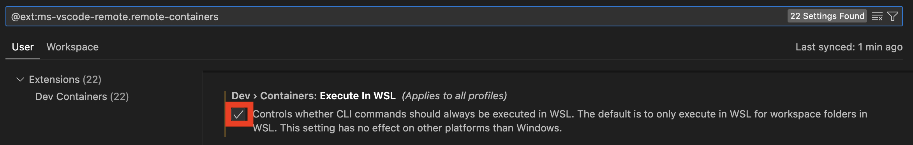
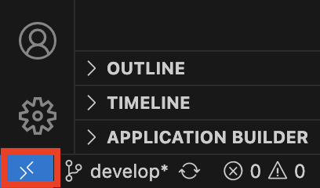
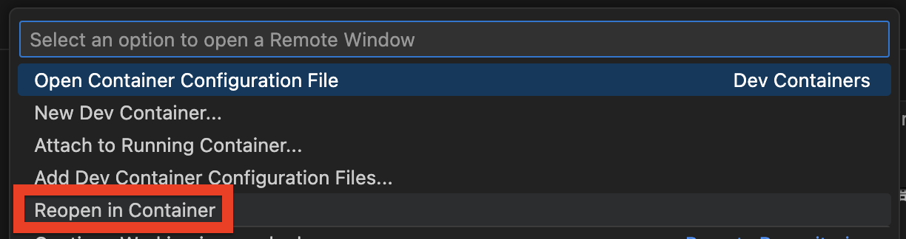

# DevContainer for Static Analysis

## Overview

This is a Visual Studio Code (VS Code) DevContainer environment based on Amazon Linux 2023.  
The DevContainer is configured with Linters and VS Code extensions.

## DevContainer Base Image

- public.ecr.aws/amazonlinux/amazonlinux:2023.7.20250527.1-minimal
  - Using Amazon Linux 2023 minimal image
  - Using `dnf` as package manager

## Software Explicitly Installed in DevContainer

### Downloaded via curl command

| Software | Version | Notes |
| --- | ---: | --- |
| actionlint | 1.7.7 | Linter for GitHub Actions |
| awscli | 2.27.32 | AWS CLI |
| ghalint | 1.4.1 | Linter for GitHub Actions |
| hadolint | 2.12.0 | Linter for Dockerfile |
| shellcheck | 0.10.0 | Linter for Bash |

### Installed via npm command

| Software | Version | Notes |
| --- | ---: | --- |
| markdownlint-cli2 | 0.18.1 | Linter for Markdown |
| npm | 11.4.1 | Node.js package manager |
| SecretLint | 9.3.4 | Secret detection tool |

### Installed via pipx command

| Software | Version | Notes |
| --- | ---: | --- |
| cfn-lint | 1.35.4 | Linter for CloudFormation |
| yamllint | 1.37.1 | Linter for YAML |

### Installed via dnf command

| Package Name | Version | Notes |
| --- | ---: | --- |
| findutils | 4.8.0 | File search utilities |
| git | 2.47.1 | Git command |
| glibc-locale-source | 2.34 | Source for generating locale data |
| gzip | 1.12 | Compression tool |
| nodejs20 | 20.19.1 | Node.js runtime |
| nodejs20-npm | 10.8.2 | Node.js package manager (standard npm package manager) |
| python3.12 | 3.12.10 | Python 3.12 |
| python3.12-pip | 23.2.1 | pip for Python 3.12 |
| tar | 1.34 | Archive tool |
| unzip | 6.0 | Decompression tool |
| xz | 5.2.5 | Compression tool |

## VS Code Extensions Used in DevContainer

| Extension | Notes |
| --- | --- |
| amazonwebservices.aws-toolkit-vscode | AWS extension |
| charliermarsh.ruff | Linter for Python |
| DavidAnson.vscode-markdownlint | Linter for Markdown |
| exiasr.hadolint | Linter for Dockerfile |
| fnando.linter | An extension that brings together various Linters. Used by yamllint |
| github.vscode-github-actions | GitHub Actions extension |
| github.copilot | GitHub Copilot extension |
| github.copilot-chat | GitHub Copilot Chat extension |
| kddejong.vscode-cfn-lint | Linter for CloudFormation |
| mechatroner.rainbow-csv | CSV extension |
| ms-ceintl.vscode-language-pack-ja | Japanese language extension |
| ms-python.python | Python extension |
| timonwong.shellcheck | Linter for Bash |

## Setup Instructions

Install the Dev Containers extension in VS Code and restart VS Code.

```bash
code --install-extension ms-vscode-remote.remote-containers
```

(When using WSL2 on Windows)  
In the Dev Containers extension settings (@ext:ms-vscode-remote.remote-containers), check "Execute In WSL".  

  

Download the repository.  
Open the downloaded folder in VS Code.  
Click "Open a Remote Window" in the bottom left corner of VS Code.



Click "Reopen in Container".


