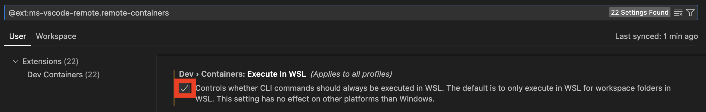
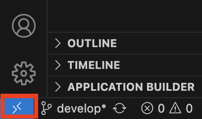
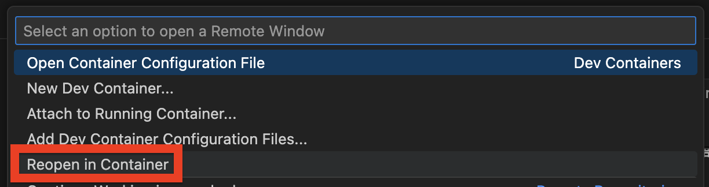

# DevContainer for Static Analysis

## Overview

This is a Visual Studio Code (VS Code) DevContainer environment based on Amazon Linux 2023.  
The DevContainer is configured with Linters and VS Code extensions.

## DevContainer Base Image

- public.ecr.aws/amazonlinux/amazonlinux:2023.9.20250929.0-minimal
  - Using Amazon Linux 2023 minimal image
  - Using `dnf` as package manager

## Software Explicitly Installed in DevContainer

### Downloaded via curl command

| Software | Version | Notes |
| --- | ---: | --- |
| actionlint | 1.7.12 | Linter for GitHub Actions |
| awscli | 2.34.57 | AWS CLI |
| ghalint | 1.5.6 | Linter for GitHub Actions |
| hadolint | 2.14.0 | Linter for Dockerfile |
| shellcheck | 0.11.0 | Linter for Bash |

### Installed via npm command

| Software | Version | Notes |
| --- | ---: | --- |
| markdownlint-cli2 | 0.22.1 | Linter for Markdown |
| npm | 11.15.0 | Node.js package manager |
| SecretLint | 13.0.2 | Secret detection tool |

### Installed via pipx command

| Software | Version | Notes |
| --- | ---: | --- |
| cfn-lint | 1.51.1 | Linter for CloudFormation |
| uv | 0.11.16 | Python package and project manager |
| yamllint | 1.38.0 | Linter for YAML |

### Installed via pip command

| Software | Version | Notes |
| --- | ---: | --- |
| pip | 26.1.1 | Bootstrap package manager for Python tooling |
| pipx | 1.12.0 | Isolated installer for Python CLI tools |
| setuptools | 82.0.1 | Bootstrap build backend for Python tooling |

### Installed via dnf command

| Package Name | Version | Notes |
| --- | ---: | --- |
| diffutils | 3.8 | Finding differences between files |
| findutils | 4.8.0 | File search utilities |
| git | 2.50.1 | Git command |
| glibc-locale-source | 2.34 | Source for generating locale data |
| gzip | 1.12 | Compression tool |
| nodejs24 | 24.15.0 | Node.js runtime |
| nodejs24-npm | 11.12.1 | Node.js package manager (standard npm package manager) |
| python3.14 | 3.14.4 | Python 3.14 |
| python3.14-pip | 25.1.1 | pip for Python 3.14 |
| tar | 1.34 | Archive tool |
| tree | 1.8.0 | File system tree viewer |
| unzip | 6.0 | Decompression tool |
| which | 2.21 | Display file path |
| xz | 5.2.5 | Compression tool |

## VS Code Extensions Used in DevContainer

| Extension | Notes |
| --- | --- |
| amazonwebservices.aws-toolkit-vscode | AWS extension |
| charliermarsh.ruff | Linter for Python |
| DavidAnson.vscode-markdownlint | Linter for Markdown |
| exiasr.hadolint | Linter for Dockerfile |
| fnando.linter | An extension that brings together various Linters. Used by yamllint |
| github.vscode-github-actions | GitHub Actions extension |
| github.copilot | GitHub Copilot extension |
| github.copilot-chat | GitHub Copilot Chat extension |
| kddejong.vscode-cfn-lint | Linter for CloudFormation |
| mechatroner.rainbow-csv | CSV extension |
| ms-ceintl.vscode-language-pack-ja | Japanese language extension |
| ms-python.python | Python extension |
| timonwong.shellcheck | Linter for Bash |

## Setup Instructions

Install the Dev Containers extension in VS Code and restart VS Code.

```bash
code --install-extension ms-vscode-remote.remote-containers
```

(When using WSL2 on Windows)  
In the Dev Containers extension settings (@ext:ms-vscode-remote.remote-containers), check "Execute In WSL".  

  

Download the repository.  
Open the downloaded folder in VS Code.  
Click "Open a Remote Window" in the bottom left corner of VS Code.



Click "Reopen in Container".


